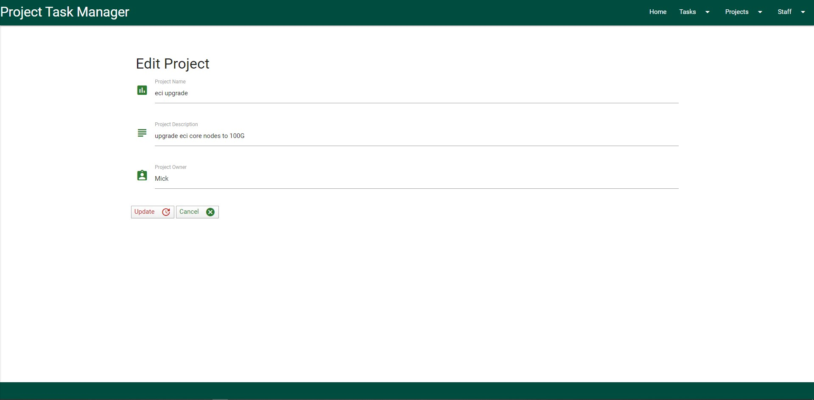

# Task Tracker

The purpose of the site is for educational purposes to test the developer knowledge of CRUD (Create, Read, Update & Delete).

The site is designed to track tasks required in the completion of projects and enable project owners to easily assign each task to a
specific user and review updates and completion.

There are 3 main elements to the database collections employed in the site.

1.  Projects
2.  Tasks
3.  Staff

# User Experience & Interface Design

The user interface screens and views were designed to keep the type of data controlled and also provide an intuitive layout with progressive
functionality.

The screens are kept minimalist and clutter free to allow the user a clear view of what is required in the completion of inputs and updates.

All Addition & Editing screens are kept similar in design, layout and colour in order to give the user an element of familiarity when transitioning from
screen to screen.

The design also allows for future features and additions to be applied without extensively changing the current layout of the screens or adding any complexity to
user experience

## Note: 
The delete function is uncontrolled as authentication is not a requirement feature of this Milestone Project and is assigned as
a new release feature to be enabled in Release 2.0 of the site.

### Home Page / View Tasks

The home page provides a view of all tasks currently assigned and can be either active or completed. Only when a task is deleted will it be
removed from this view.

All fields and switches are disabled on the home page to ensure no accidental edits or deletion are applied when viewing tasks.

### Projects

#### Add Projects

This screen enables the user to add a new project to the workstream and consists of 3 entry options

1.  Project Name - The name of the overall project for which team tasks are to be applied and assigned.
2.  Project Description - A summarised description of the project and purpose.
3.  Project Owner - The staff member within the team responsible for driving team tasks to completion.

#### Manage Projects

This screen enables the user to edit or delete an existing project in the workstream.

The screen displays the Project Name & Owner with a dropdown option to view the Project Description.

The are also 2 button options for Del & Edit

### Tasks

#### Add Task

This screen enables the user to add a new project to the workstream and consists of 3 entry options

1.  Project Name - The project name to be chosen from a dropdown list of existing projects.
2.  Task Name - Name applied to the specific tasks.
3.  Task Description - A brief description of the tasks and the requirements for completion.
4.  Assign To - The name of the staff member the task is to be assigned to, available from a dropdown list of existing staff members.
5.  Due Date - The date by which the task is to be completed.

There are also 3 switches to record if the task is;

Is Key - is this a key task that should be given a higher priority.
External Customer - to be enabled if the task is for an external customer project.
Is Billable - to be enabled if there is a cost applied to the task and a revenue source is provided

#### Manage Tasks

This screen enables the user to edit or delete an existing task in the workstream.

The screen displays the Project Name, Task Name, Due Date & Assigned To fields with a dropdown option to view the Task Description.

The are also 2 button options for Del & Edit

The edit option also provides an additional switch to be enabled should the task be completed.

### Staff

#### Add Staff

This screen enables the user to add a new project to the workstream and consists of 3 entry options

1.  Staff Name - Staff member to be added to the task assignment list.
2.  Staff Team - The team or group the staff member belongs to.

#### Manage Staff

This screen enables the user to edit or delete an existing project in the workstream.

The screen displays the Staff Name with a dropdown option to view the Staff Team.

## Future Release & development

•	A search bar to be added to the html to allow users to query the database.

•	Pagination to be applied to the view and edit screens to cater for growing number of tasks and projects.

•	Authentication to be applied to validate users and manage deletions of tasks, projects & staff.

# TECHNOLOGIES

*   [Materialize](https://materializecss.com/) - For HTML and CSS design, layout & Styles
*   [Python](https://www.python.org/) -   programming language that lets you work quickly and integrate systems more effectively
*   [JQuery](https://www.jquery.com/) -   To support the development for the pages
*   [MongoDB](https://www.mongodb.com/) -   general purpose, document-based, distributed database
*   [Flask](https://www.palletsprojects.com/p/flask/) -   Flask is a lightweight WSGI web application framework
*   [Heroku](https://www.heroku.com/home) -   Deploy and run apps

